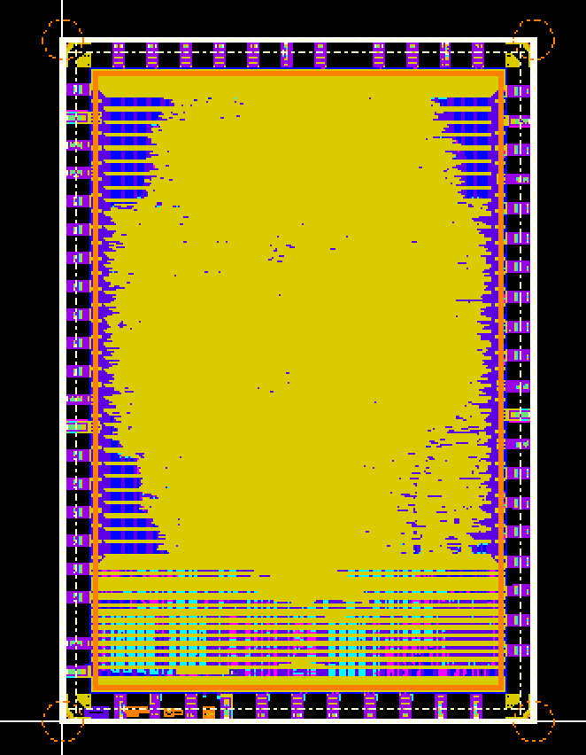

# Getting Started

## What is Physical Design?

Physical design is the process of turning the RTL made by the Digital Design and Digital Verification teams into an actual chip layout we can send to a foundry.

Physical design is very important to the tapeout process, and it's where a lot of the decisions that affect the performance of the final chip are made. It is a physical designer's job to take the somewhat abstract RTL created by digital designers and optimize it into a physical chip under the real-world constraints of power, timing, and area.



*The final layout of our Tapeout 1 design, containing over 3 million transistors!*

## About the Project
The Physical Design (PD) subteam onboarding project is intended to guide you through fundamental scripting techniques and their use within the physical design process. 

The project involves completing the tasks in `assignment.docx`. The assignment includes the following tasks:
- Introduction to Physical Design: OpenLane Colab Notebook
- Clocking a Sequential Circuit
- Python Timing Report Analysis
- Flow Debugging
- Tcl Procedures
- 32-bit Adder Static Timing Analysis
- Investigating Design Rule Violations

Physical Design is a broad discipline that involves a wide array of skills. If you haven't had any experience with VLSI in the past, don't expect to be able to open up `assignment.docx` and finish it in an hour — you will have to research, ask questions, and _learn_ to complete the project.

We try to offer as many resources as we can to guide you through this project. We've linked plenty of resources for you to get started with new topics within the assignment, there are guides in `docs/` to answer frequently asked questions, and we're always happy to answer questions posted in the Discord.

<!-- Studying [our previous meeting slides and recordings](https://gtvault.sharepoint.com/:f:/s/SiliconJackets/EjEEHzoern5BuoCrHQzF_v4BgYGWufW_8Qi9igfp1YEVFA?e=UBzogT) is a great way to get caught up on the basics. !-->

### Tools You'll Use

<details>
<summary><b>Cadence Genus</b></summary>
Genus is the first Cadence tool we use in the design process. It takes RTL files and synthesizes them into netlists.
<br><br>
<blockquote>
<b>What's a netlist?</b>
<br>
A netlist is a list of all the logic gates used in a design and how they're connected. The netlist generated by synthesis doesn't specify where each gate is or how far apart they are; just that the connections exist. That information isn't added until after Place and Route.

Netlists are used to generate the actual chip layout and perform STA.
</blockquote> 

<blockquote> 
<b> ... What's STA? </b>
<br>
STA stands for Static Timing Analysis. In STA, we use the worst-case propagation delays of each gate to make an educated guess about how long data takes to go from input to output in each part of our circuit. This lets us estimate how fast we can clock our design — the period of our cycle has to be <i>longer</i> than the time it takes for a signal to propagate through our longest path.
</blockquote>

A lot of the synthesis process is automated by Genus's algorithms, but designers can influence the final netlist by setting Power, Timing, and Area constraints to influence how Genus optimizes the design. This comes with tradeoffs, though — the tighter the constraints, the longer synthesis takes to run. If the constraints are too tight, it may even fail.

You won't have to directly interact with Genus during this assignment, but it will be used in the background by our flowtool.
</details>


<details>
<summary><b>Cadence Innovus</b></summary>
<p>
After we generate a netlist with Genus, we want to figure out where each logic gate goes. This stage is called Place and Route (PnR).

Innovus takes the pre-layout netlist and performs the following processes on it:

<ul>
    <li><b>Floorplanning:</b> Create an initial floorplan to determine the overall size and aspect ratio of the chip and place major logic blocks and I/O pads.</li>
    <li><b>Placement:</b> Place standard cells (logic gates specified by our design library) and optimize their placement for timing, area, and congestion. </li>
    <li><b>Clock Tree Synthesis (CTS):</b> Distribute a clock signal across the design. It takes time to propagate signals, so Innovus needs to carefully optimize the clock layout to make sure the clock signal doesn't get to any part of the design too early or too late.  </li>
    <li><b>Routing:</b> Place connections between standard cells, assign metal layers, and insert vias to connect them.  </li>
    <li><b>Optimization:</b> Now that the overall layout is almost done, Innovus goes back and optimizes decisions made in all the previous steps.</li>
    <li><b>Signoff:</b>  The cell library used in a chip enforces a set of rules that dictate how small cells can be, how close together they can be packed, and other restrictions. Innovus tries to follow these rules during the entire process, but sometimes errors may be looked over or unavoidable. This step generates a Design Rule Checking (DRC) report that lets us know potential problems without design.   </li>
    <li><b>Output:</b> Outputs a GDSII file. This is the file that specifies the final layout of our chip. This is what we send to the foundry!</li>
</ul>
During the entire process, Innovus optimizes Power, Timing, and Area more or less agressively depending on the design constraints specified by the physical designer. This is a tradeoff between performance and PnR runtime.
</p>
</details>


<details>
<summary><b>Cadence Tempus</b></summary>
<p>
We use Cadence Tempus for Static Timing Analysis. It takes in a netlist and simulates signal transition times to generate a timing report telling us the time each path takes, the longest paths, and whether we have timing violations.

While we get the most accurate timing results after Signoff (the last step of PnR), we typically perform STA all throughout the design process to get an idea of the performance of our chip earlier on so we know how hard we'll have to optimize, or whether the clock speed we want is even possible with our design.

Like Genus, you won't directly interact with Tempus during this assignment, but you will need to look through the timing reports it generates as part of our flow.
</p>
</details>

<details>
<summary><b>FastX or MobaXterm</b></summary>
<p>
Innovus runs on the Linlab servers. Since it has a GUI, you'll need a terminal emulator with X11 forwarding enabled to be able to use it.

We recommend FastX or MobaXterm, but any remote terminal with GUI support should work.
</p>
</details>

<details>
<summary><b>TCL</b></summary>
<p>
TCL is pronounced "Tickle." 

It stands for Tool Command Language. It's a scripting language used in electronic design automation (EDA). We use it because, while optimizing a chip, we will run the "flow" (the process of turing RTL into a design file) many times. This flow involves running a whole bunch of commands in our CLI, and doing this over and over can get exhausting.

Instead of typing all these commands manually, we can use TCL to create scripts that will run the flow for us!

Many TCL scripts that make running our flow easier already exist, so while it's not explicitly required to learn TCL, learning about it helps to understand what's happening when you run the flow.

Here's a simple TCL file, `greeting.tcl`, as an example:


```bash
set name "John"
set greeting "Hello, $name!"
puts $greeting
```

To run it, we run `tclsh greeting.tcl`:

```bash
[user@host] tclsh greeting.tcl
Hello, John!
```

To learn more about TCL, see [this resource](https://www.tcl.tk/man/tcl8.5/tutorial/tcltutorial.html).

[Here is a tutorial](https://www.tutorialspoint.com/tcl-tk/tcl_environment.htm) on how you could set up an environment and play around with TCL by writing simple scripts.
</p>
</details>

<details>
<summary><b>Python</b></summary>
<p>
You'll need to know some basic Python File I/O and String processing in order to parse the timing report file we've provided you.

[This guide on File I/O](https://www.tutorialspoint.com/python/python_files_io.htm) and [this guide on String processing](https://www.pythoncentral.io/how-to-parse-a-string-in-python-a-step-by-step-guide/) might be good places to start if you don't have any Python experience.

You might also need to understand some (very) basic Python data structures to store the information you extract from the file.
</p>
</details>

## Resources
- Read the `docs/`!
- [Setup and Hold Times](https://nandland.com/lesson-12-setup-and-hold-time/)
- [Static Timing Analysis](https://anysilicon.com/the-ultimate-guide-to-static-timing-analysis-sta/)
- [STA (Advanced)](https://www.eng.biu.ac.il/temanad/files/2018/12/Lecture-5-STA.pdf)
- [Python File I/O](https://www.tutorialspoint.com/python/python_files_io.htm)
- [Python String Processing](https://www.pythoncentral.io/how-to-parse-a-string-in-python-a-step-by-step-guide/)
- The [Cadence Support](https://www.support.cadence.com) website
- The SiliconJackets Discord
- Contact a team lead:

| Lead Name | Email | Discord |
| --- | --- | --- |
| Cooper Shaw | shaw\@gatech.edu | cooper.shaw |
| Julian Grinberg | jgrinberg7\@gatech.edu | juleslop |
| Patricio Cortez | pcortez3\@gatech.edu | lovebaron |
| Josh Perez | jperez321\@gatech.edu | jp_1234. |
| Jiho Jun | jjun49\@gatech.edu | Dj0812 |
